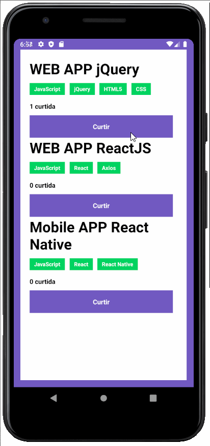

# 3º Desafio - GoStack Rocketseat
## Conceitos Mobile com React Native

Desafio: criar uma aplicação para treinar o que foi aprendido até agora no React Native!

Agora você deve continuar desenvolvendo a aplicação que irá armazenar repositórios do seu portfólio, que você já desenvolveu o backend utilizando o Node.js, e no último desafio em ReactJS.

* Listar os repositórios da sua API: Deve ser capaz de criar uma lista de todos os repositórios que estão cadastrados na sua API com os campos title, techs e número de curtidas seguindo o padrão ${repository.likes} curtidas, apenas alterando o número para ser dinâmico.

* Curtir um repositório listado da API: Deve ser capaz de curtir um item na sua API através de um botão com o texto Curtir e deve atualizar o número de likes na listagem no mobile.

Segue GIF da aplicação funcionando:

__Imagem__

